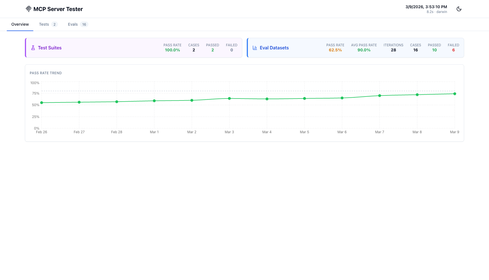
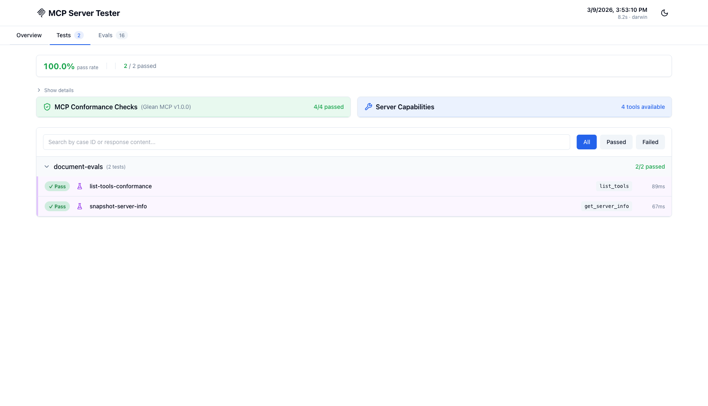
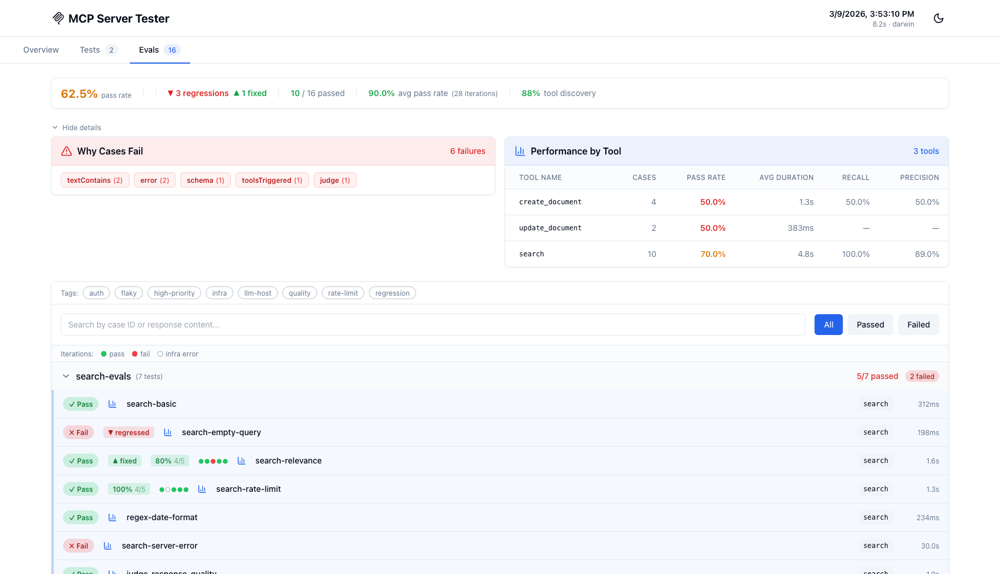

# UI Reporter Guide

`@gleanwork/mcp-server-tester` includes a custom Playwright reporter with an interactive web UI for visualizing test results. It is organized into three tabs — Overview, Tests, and Evals — so that deterministic tests and probabilistic eval results are never mixed together.

## Configuration

Add the reporter to your `playwright.config.ts`:

```typescript
import { defineConfig } from '@playwright/test';

export default defineConfig({
  reporter: [
    ['list'], // Keep the terminal output
    ['@gleanwork/mcp-server-tester/reporters/mcpReporter'], // Add the UI reporter
  ],
  // ... rest of config
});
```

## Usage

The reporter automatically generates an HTML report after each test run:

```bash
npm test

# Report generated at: .mcp-test-results/latest/index.html
# Opens automatically in your default browser
```

To open a previous report:

```bash
npx mcp-server-tester open
```

---

## Overview Tab



The Overview tab shows **Test Suites** and **Eval Datasets** side by side with their own separate pass rates. These are fundamentally different kinds of results — a test is binary (pass or fail), an eval has an assertion pass rate across iterations — so they are never collapsed into a single combined number.

Below the cards, the **Pass Rate Trend** chart shows historical pass rates across runs. This is the main signal for answering "are we getting better over time?"

---

## Tests Tab



The Tests tab shows Playwright test suite results — deterministic, binary pass/fail tests that call MCP tools directly and assert on the output.

### What's shown

- **Pass rate and count** — `100.0% pass rate | 2/2 passed`
- **MCP Conformance Checks** — expandable panel showing protocol compliance (server info present, capabilities valid, list tools succeeds, required tools present). Collapsed by default.
- **Server Capabilities** — expandable panel listing all tools the server exposes with their descriptions
- **Results table** — grouped by test file, each row shows case ID, tool name, and duration

### MCP Conformance Checks

Conformance checks validate that your MCP server implements the protocol correctly:

- `server_info_present` — server returns name and version
- `capabilities_valid` — capability declaration is well-formed
- `list_tools_succeeds` — `tools/list` returns without error
- `required_tools_present` — any tools declared in `requiredTools` are available

---

## Evals Tab



The Evals tab shows data-driven eval dataset results, including multi-iteration accuracy and LLM host mode tool discovery metrics.

### Metrics bar

From left to right, in order of urgency:

- **Pass rate** — fraction of cases that passed their accuracy threshold
- **Regressions / fixed** — cases that changed vs the baseline run (only shown when a baseline is provided)
- **X/Y passed** — compact pass count
- **Avg pass rate** — mean assertion pass rate across multi-iteration cases
- **Tool discovery** — mean recall across `mcp_host` cases with `toolsTriggered` expectations

### Iteration dots and CI

For multi-iteration cases, each row shows:

- A pass rate badge: `80% 4/5`
- Iteration dots showing per-run results

The dot legend below the filter bar explains the symbols:

| Symbol    | Meaning                                        |
| --------- | ---------------------------------------------- |
| ● (green) | Iteration passed                               |
| ● (red)   | Iteration failed                               |
| ○ (grey)  | Infrastructure error (excluded from pass rate) |

Infrastructure errors (network timeouts, rate limits) are excluded from the assertion pass rate denominator so environment reliability doesn't inflate your accuracy numbers.

### Detail panel

Click **Show details** to expand:

- **Why Cases Fail** — breakdown of which expectation types are causing failures (`textContains`, `schema`, `judge`, etc.)
- **Performance by Tool** — per-tool pass rate, average duration, recall, and precision

### Tag filtering

Tag buttons above the search bar let you filter to specific subsets. Tags come from the `tags` field on your eval cases.

---

## Detail Modal

Click any result row to open the detail modal:

1. **Status and metadata** — Pass/Fail badge, source (Eval Dataset or Test Suite), auth type, project
2. **Pass rate and CI** (multi-iteration only) — assertion pass rate with 95% confidence interval. Hover for: _"the true pass rate is likely between X% and Y%. Run more iterations to narrow this range."_
3. **Error details** — error message and stack trace (failed cases only)
4. **Response preview** — full tool response, scrollable
5. **Expectation results** — each expectation type with pass/fail and failure message
6. **Duration** — total execution time

---

## Results Organization

Results are saved to `.mcp-test-results/`:

```
.mcp-test-results/
├── latest/                    # Symlink to most recent run
│   ├── index.html            # Main UI
│   ├── data.js               # Test results data
│   ├── app.js                # UI JavaScript
│   └── styles.css            # UI styles
└── run-2025-01-24T12-00-00/  # Timestamped runs
    └── ...
```

Each run creates a timestamped directory. `latest/` is a symlink to the newest run — useful for CI artifacts and bookmarking.

Add to `.gitignore`:

```gitignore
.mcp-test-results/
```

---

## CI/CD Integration

### GitHub Actions

```yaml
name: MCP Tests
on: [push]
jobs:
  test:
    runs-on: ubuntu-latest
    steps:
      - uses: actions/checkout@v4
      - uses: actions/setup-node@v4
      - run: npm ci
      - run: npm test

      - uses: actions/upload-artifact@v4
        if: always()
        with:
          name: mcp-test-results
          path: .mcp-test-results/latest/
          retention-days: 30
```

Download the artifact and open `index.html` to view results.

---

## Configuration Options

```typescript
[
  '@gleanwork/mcp-server-tester/reporters/mcpReporter',
  {
    outputDir: '.mcp-test-results', // Where to save reports (default)
    autoOpen: false, // Open browser after run (default: true)
    historyLimit: 10, // Historical runs to keep (default: 10)
    quiet: false, // Suppress console output (default: false)
    includeAutoTracking: true, // Include MCP fixture calls without explicit evals (default: true)
  },
];
```

### External History Storage

The reporter can load and save historical runs through a result store. This keeps
the trend chart useful across CI jobs and local machines while still writing the
normal local report.

```typescript snippet=snippets/result-store-reporter-config.ts
import { defineConfig } from '@playwright/test';

export default defineConfig({
  reporter: [
    ['list'],
    [
      '@gleanwork/mcp-server-tester/reporters/mcpReporter',
      {
        outputDir: '.mcp-test-results',
        resultStore: {
          provider: 'gcs',
          bucket: 'my-mcp-eval-results',
          prefix: 'my-server/main',
        },
        runMetadata: {
          branch: process.env.GITHUB_REF_NAME ?? 'local',
          trigger: process.env.GITHUB_EVENT_NAME ?? 'manual',
        },
      },
    ],
  ],
});
```

GCS storage uses Application Default Credentials. Set
`GOOGLE_APPLICATION_CREDENTIALS` locally or in CI before running Playwright.
`mcp-server-tester open` opens the local `.mcp-test-results/latest/` report only
in v1; externally stored JSON is intended for history, baselines, dashboards, and
AI analysis.

---

## Troubleshooting

### Report not generated

- Verify the reporter is in `playwright.config.ts`
- Check for write permission errors in `.mcp-test-results/`
- Ensure tests actually ran

### Browser doesn't open

Set `PLAYWRIGHT_SKIP_BROWSER_OPEN=1` to suppress auto-open, or open manually:

```bash
npx mcp-server-tester open
```

### Missing data

- Check browser console (F12) for JavaScript errors
- Verify `data.js` was generated alongside `index.html`

## Next Steps

- See the [Quick Start Guide](./quickstart.md) for running tests
- Check the [Expectations Guide](./expectations.md) for validation setup
- Explore [Examples](../examples) for sample test suites
